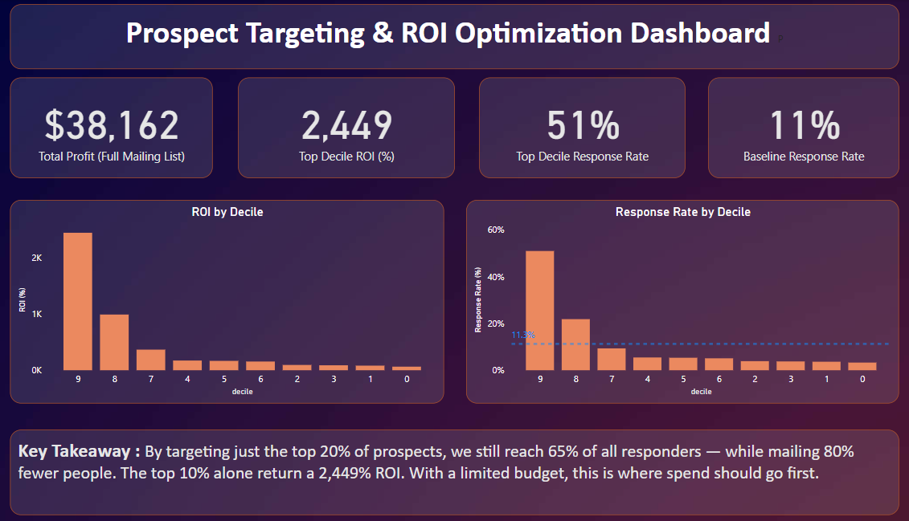

# Customer Acquisition: Propensity & ROI Targeting

Predicting which prospects (potential customers) are worth mailing in a direct mail acquisition campaign, and turning that into a targeting decision instead of "mail everyone and hope."

## Problem
Direct mail costs money per piece, but most prospects never respond. Mailing without prioritization wastes budget on people who were never going to convert. This project ranks prospects by likelihood to respond and shows exactly how deep into that list it stays profitable to mail.

## Data
[UCI Bank Marketing dataset](https://archive.ics.uci.edu/dataset/222/bank+marketing) (~41k rows). Phone-based marketing data, structurally similar to direct mail — contact a prospect, they respond or they don't.

## Approach
- Cleaned the data, kept "unknown" values as their own category instead of dropping ~21% of rows
- Found and removed `duration` (call length) — it's almost perfectly correlated with the outcome, but only known *after* the call happens, so it would've leaked the answer
- Used logistic regression as a simple, explainable baseline instead of jumping to a more complex model — it performed well enough that added complexity wasn't clearly justified
- Since only ~11% of prospects respond, accuracy is meaningless — ranked prospects into deciles by predicted probability and measured actual response rate per decile
- Attached real economics ($1/mail, $50/acquisition — stated assumptions) to calculate profit and ROI at each decile
## Dashboard
- Built a one-page Power BI dashboard summarizing the above — KPI cards, response rate and ROI by decile, and a plain-language takeaway banner. (Screenshot below.)
  

## Key finding
Targeting just the top 20% of prospects still captures 65% of all responders while mailing 80% fewer people. The top 10% alone return a 2,449% ROI.

## Tools
Python (pandas, scikit-learn) for modeling and analysis · Power BI for the final dashboard · Excel/Sheets for initial exploration

## Limitations
Mail cost and acquisition value are illustrative assumptions, not sourced figures. Only logistic regression was tested in depth — a tree-based model might improve ranking slightly, but the decile lift was already clean enough that I didn't see strong evidence it was necessary.
